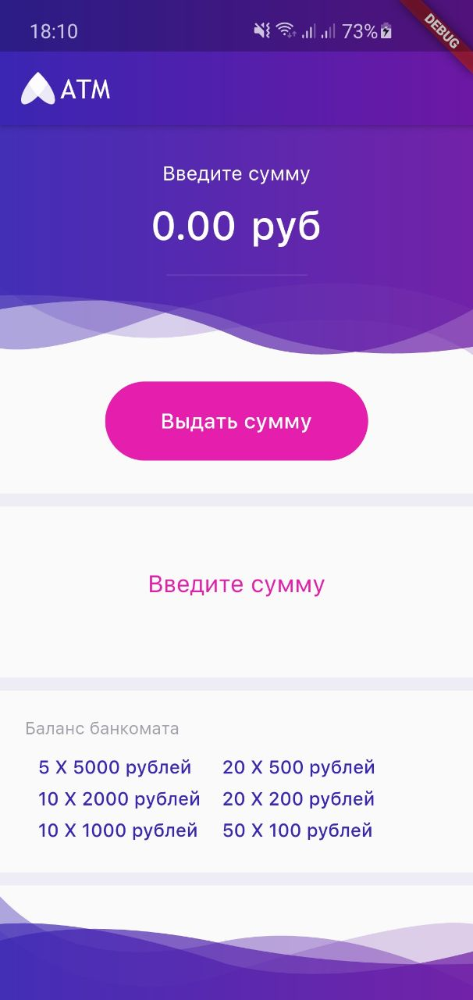
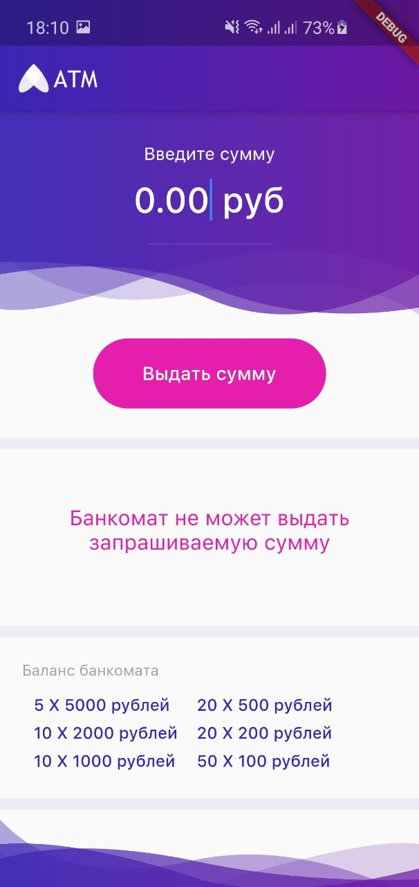
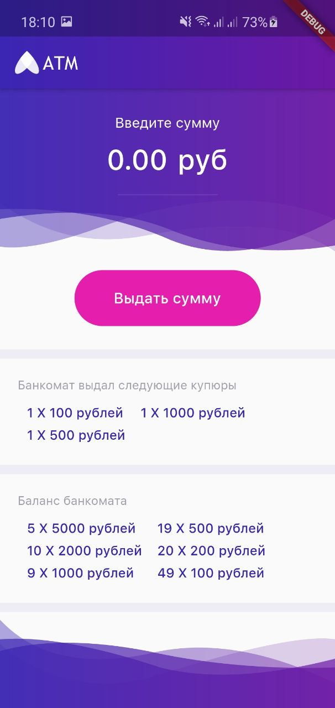
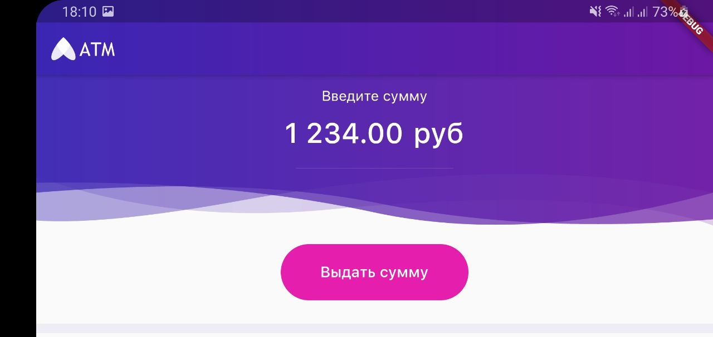
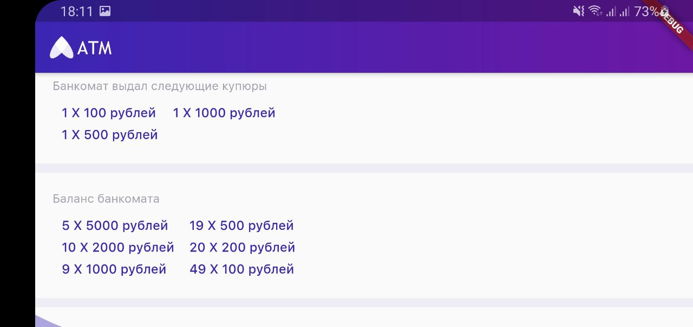
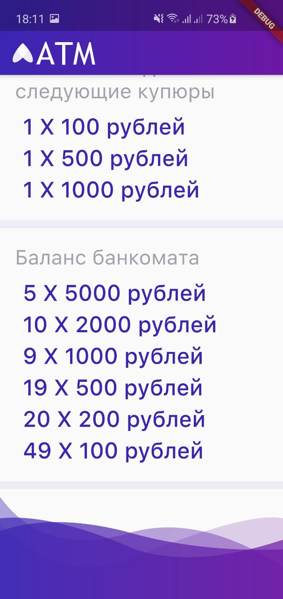

# Тестовое задание

Приложение банкомат с применением паттерна BLoC

## Тестовое задание Flutter
### Особенности:
- Применен архитекутрный паттерн BLoC
- Адаптивная верстка
- Limits задается в классе AtmState в виде Map

### Скриншоты:
.
.
.
### Скриншоты (ландшафтный режим):
.
.
### Скриншоты (адаптивность интерфейса при огромных шрифтах):
.
.
.

